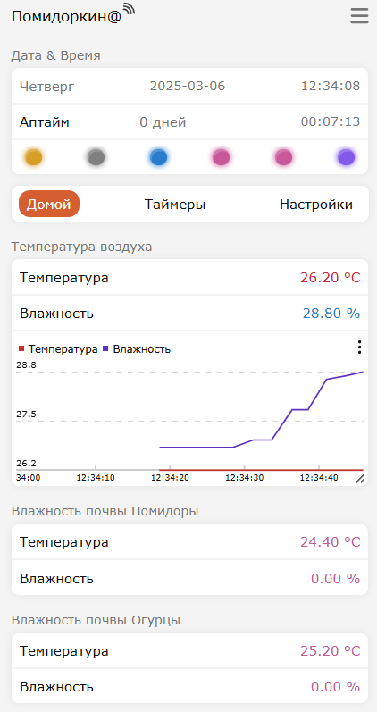
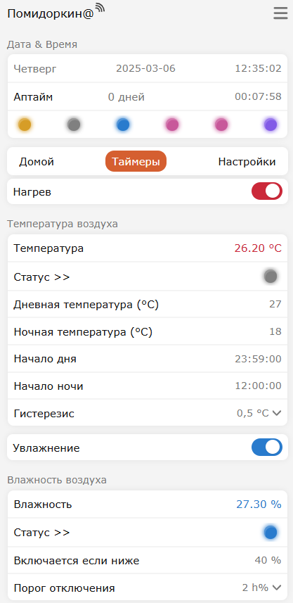
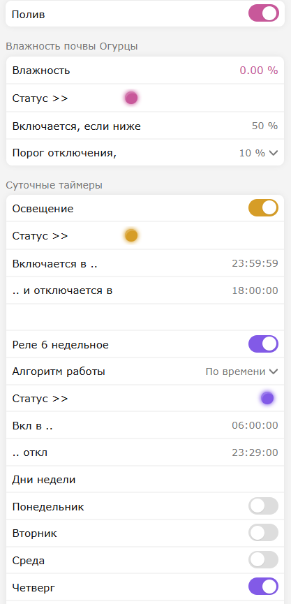
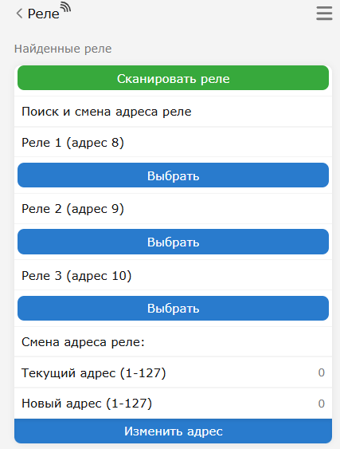

<h1 align="center"> Pomodorkin </h1>

### Контроллер для управления климатом в гроубоксе.  
Основан на плате esp32, содержит веб морду с гибкими настройками для упралвения таймерами, реле и отображения параметров окр. среды. 
Основан на Гайверовской библиотеке Settings

# Система управления микроклиматом "Помидоркин"

## Скриншоты веб-интерфейса
<table>
<tr>
<td></td>
<td></td>
</tr>
<tr>
<td></td>
<td></td>
</tr>
<tr>
<td colspan="2"></td>
</tr>
</table>

## Общее описание
Проект представляет собой систему управления микроклиматом на базе ESP32, которая позволяет контролировать температуру и влажность воздуха, а также влажность почвы. Система оснащена веб-интерфейсом для удобного управления и мониторинга.

## Основные компоненты
1. **Контроллер**: ESP32
2. **Датчики**:
   - **Датчик воздуха**: Блок климатический (температура, влажность, освещенность)
     - Интерфейс: RS485 / Modbus
     - Измеряемые параметры:
       - Температура воздуха
       - Влажность воздуха
       - Освещенность
     - Протокол связи: Modbus RTU
     - Адрес по умолчанию: 4
     - [Инструкция по эксплуатации](sensor/air_sensor.pdf)
   - **Датчики почвы**: CWT-Soil-THC-S
     - Интерфейс: RS485 / Modbus
     - Измеряемые параметры:
       - Температура почвы
       - Влажность почвы
     - Протокол связи: Modbus RTU
     - Адреса: 1 и 3
     - [Инструкция по эксплуатации](sensor/soil_sensor.pdf)
3. **Управляющие устройства**:
   - Реле для управления нагревом воздуха
   - Реле для управления увлажнением воздуха
   - Реле для управления поливом почвы
   - Реле для управления поливом второй почвы
   - Два дополнительных реле для таймеров

## Основные функции

### Управление температурой воздуха
- Два режима работы: дневной и ночной
- Настраиваемые параметры:
  - Дневная температура (по умолчанию 25°C)
  - Ночная температура (по умолчанию 20°C)
  - Время начала дня (по умолчанию 6:00)
  - Время начала ночи (по умолчанию 20:00)
  - Гистерезис (0.5°C, 1°C, 2°C, 3°C)
- Автоматическое переключение между режимами
- Учет перехода через полночь

### Управление влажностью воздуха
- Поддержание заданного уровня влажности
- Настраиваемый гистерезис
- Автоматическое включение/выключение увлажнителя

### Управление влажностью почвы
- Два независимых канала управления
- Поддержание заданного уровня влажности
- Настраиваемый гистерезис
- Автоматическое включение/выключение полива

### Таймеры
- Два независимых таймера
- Возможность настройки времени включения/выключения
- Поддержка перехода через полночь
- Недельное расписание для второго таймера

## Технические особенности
1. **Связь**:
   - WiFi для веб-интерфейса
   - I2C для управления реле
   - Modbus RTU для датчиков

2. **Хранение данных**:
   - Использование файловой системы LittleFS
   - База данных для хранения настроек

3. **Безопасность**:
   - Автоматическое отключение при неисправности датчиков
   - Защита от перегрева
   - Настраиваемые пороги срабатывания

4. **Интерфейс**:
   - Веб-интерфейс с поддержкой мобильных устройств
   - Визуализация состояния реле
   - Отображение текущих показаний датчиков
   - Настройка всех параметров через веб-интерфейс

5. **Управление реле**:
   - Сканирование доступных реле в сети I2C
   - Отображение списка найденных реле с их адресами
   - Возможность изменения адреса реле через веб-интерфейс
   - Валидация новых адресов (диапазон 1-127)
   - Уведомления об успешной смене адреса или ошибках

6. **Настройка WiFi**:
   - Автоматическое сканирование доступных сетей
   - Выбор сети из списка найденных
   - Настройка SSID и пароля
   - Автоматическое переподключение при потере связи
   - Режим точки доступа при отсутствии подключения
   - Таймаут подключения (10 секунд)
   - Автоматический перезапуск при длительном отсутствии связи

## Особенности реализации
- Модульная архитектура
- Конечный автомат для управления реле
- Адаптивное управление с учетом гистерезиса
- Поддержка различных режимов работы
- Автоматическое восстановление после сбоев

Это комплексная система, которая может использоваться для управления микроклиматом в теплицах, оранжереях или других помещениях, где требуется поддержание определенных параметров температуры и влажности.

